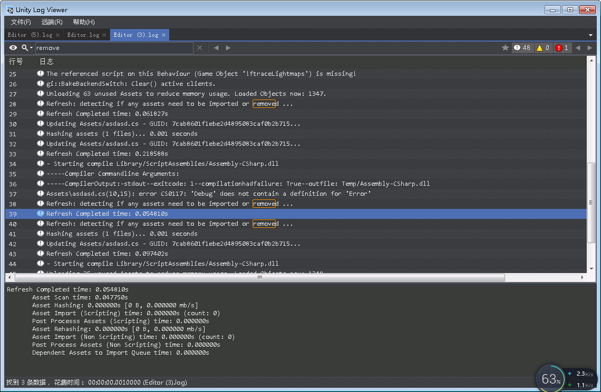

# UnityLogViewer

- A lightweight, standalone Unity log viewer
- Quick view Unity `Editor.log` file
- ADB logcat viewer, filter by `Unity` tag
- [UDP remote log](https://github.com/akof1314/UnityLogViewer/blob/master/UnityLogUdp/readme.md), remote debug command
- View [Unity-ConsoleTiny](https://github.com/akof1314/Unity-ConsoleTiny) export log file

## Features

- Very fast
- Supports huge files
- Multiple search modes
- Highlight search text
- Shortcuts

## Screenshots

## Thanks
[LogViewer](https://github.com/woanware/LogViewer): LogViewer for viewing and searching large text files