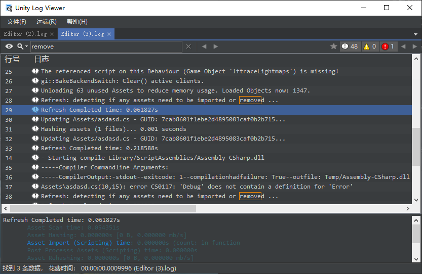

# UnityLogViewer

基于 [LogViewer](https://github.com/woanware/LogViewer) 实现的查看 Unity `Editor.log`文件，以及可以查看插件[Unity-ConsoleTiny](https://github.com/akof1314/Unity-ConsoleTiny) 导出的日志文件。

## 功能

- 速度很快
- 支持大文件
- 快捷键支持
- 多种搜索模式

## 截图

